# 👋 Hi friends, I'm Scott Sinclair

## Profile
Highly ambitious software architect with more than 18 years of experience contributing to all aspects of the software development lifecycle.

>Detail-oriented technical lead with success at designing solutions to meet customer and product requirements.

>Effective leader with strong technical and organizational skills, and the ability to work in a fast-paced environment to achieve stakeholder acceptance while maintaining schedule and budget.

>Open minded and curious. Always interested in problem solving and the enjoyment of creating and architecting solutions that are scalable and can be used as a framework for future development.

## Education and Work Experience

```mermaid
gantt
    axisFormat %Y
    section 🏫 Education
    University of Pittsburgh  :active, edu1, 1999-08-01,2004-01-01

    section 🏢 Work 
    Speech Interface Design :active, wrk1, 2004-04-01,2012-04-01
    Bombardier              :active, wrk2, 2012-04-01,2021-04-01
    CMU/SEI                 :active, wrk3, 2021-04-01,2022-08-24

    click cl1 href "#profile1"
```

## Profile1

Open minded and curious. Always interested in problem solving and the enjoyment of creating and architecting solutions that are scalable and can be used as a framework for future development.

Open minded and curious. Always interested in problem solving and the enjoyment of creating and architecting solutions that are scalable and can be used as a framework for future development.

Open minded and curious. Always interested in problem solving and the enjoyment of creating and architecting solutions that are scalable and can be used as a framework for future development.
[An Internal Link](#profile1)

## Profile2

Open minded and curious. Always interested in problem solving and the enjoyment of creating and architecting solutions that are scalable and can be used as a framework for future development.

Open minded and curious. Always interested in problem solving and the enjoyment of creating and architecting solutions that are scalable and can be used as a framework for future development.

Open minded and curious. Always interested in problem solving and the enjoyment of creating and architecting solutions that are scalable and can be used as a framework for future development.

## Profile3

Open minded and curious. Always interested in problem solving and the enjoyment of creating and architecting solutions that are scalable and can be used as a framework for future development.

Open minded and curious. Always interested in problem solving and the enjoyment of creating and architecting solutions that are scalable and can be used as a framework for future development.

Open minded and curious. Always interested in problem solving and the enjoyment of creating and architecting solutions that are scalable and can be used as a framework for future development.

## Profile 4

Open minded and curious. Always interested in problem solving and the enjoyment of creating and architecting solutions that are scalable and can be used as a framework for future development.Open minded and curious. Always interested in problem solving and the enjoyment of creating and architecting solutions that are scalable and can be used as a framework for future development.

Open minded and curious. Always interested in problem solving and the enjoyment of creating and architecting solutions that are scalable and can be used as a framework for future development.Open minded and curious. Always interested in problem solving and the enjoyment of creating and architecting solutions that are scalable and can be used as a framework for future development.